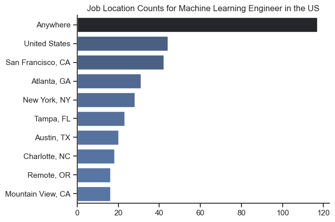
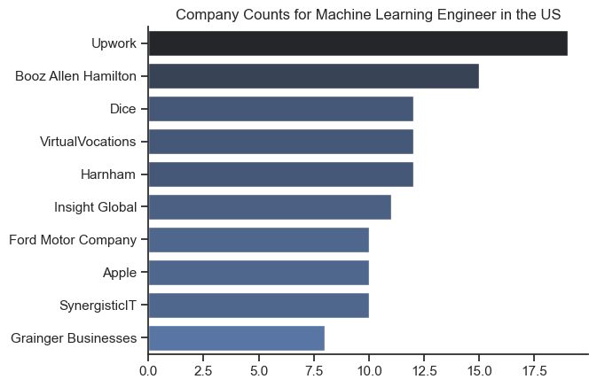
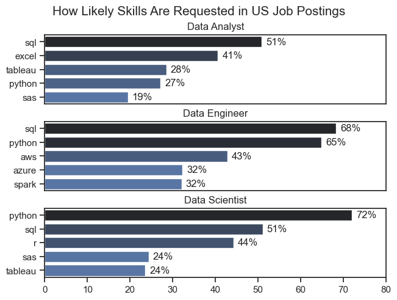
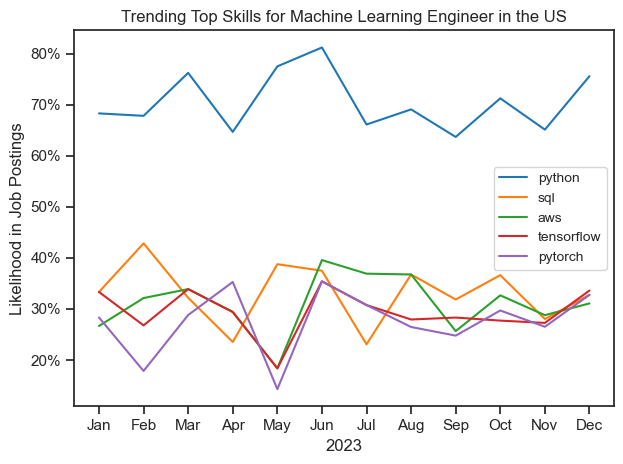
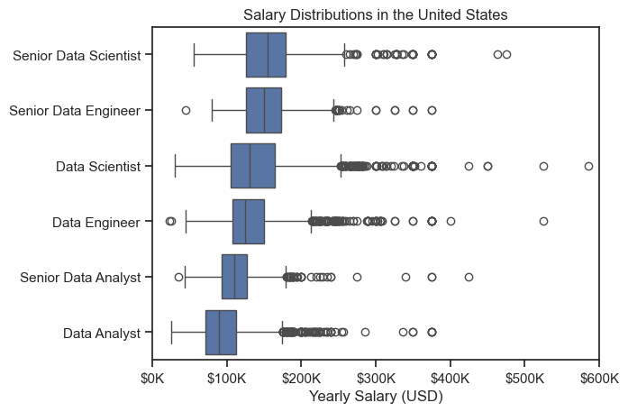
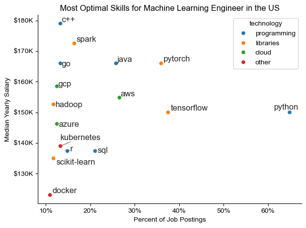

# Introduction
📊 This project presents a Python-based data analysis of job postings in the United States, with a specific focus on Machine Learning Engineer (MLE) roles. Using tools such as pandas, seaborn, and matplotlib, the analysis explores key aspects of the MLE job market, including the most in-demand skills and salary distributions. The goal is to uncover patterns that help aspiring MLEs and industry professionals better understand employer expectations, prevalent technologies, and opportunities across the US. Through data visualization and exploratory analysis, the project offers actionable insights into one of the most rapidly growing tech careers today.

# Python Skills Used

- Data Cleaning with pandas (handling missing values, duplicates, and formatting)
- Exploratory Data Analysis (EDA) using pandas, seaborn, and matplotlib
- Data Visualization (scatter plots, bar charts, custom annotations)
- Grouping and Aggregation (using `groupby`, `agg`, `pivot_table`)
- String and text processing (e.g., parsing dictionaries from stringified columns)
- Working with `ast.literal_eval`
- Sorting and filtering data for insights
- Labeling and annotating plots with `adjustText`
- Formatting axes and customizing plots with matplotlib
- Basic use of Python control structures and dictionary operations

# The analysis
## 1. What insights can we uncover from the Exploratory Data Analysis (EDA)?
### 🌍 Top Job Locations 

- **"Anywhere"** is the most common location, supporting the growing prevalence of remote roles despite low WFH offers.
- Top US cities include **San Francisco, Atlanta, New York**, and **Austin**, aligning with known tech hubs.
- The appearance of smaller or less expected cities like **Tampa** and **Charlotte** suggests geographical diversification in ML job opportunities.

### 🎯 Job Features Offered 

- **Work From Home**: Only **12.7%** of Machine Learning Engineer (MLE) jobs offer remote work options, indicating that most roles (87.3%) are still location-dependent.
- **Degree Requirements**: A significant **95.9%** of MLE roles **do not** require a formal degree, suggesting a trend towards skill-based hiring in the ML space.
- **Health Insurance**: Just **36.8%** of listings mention offering health insurance, potentially pointing to a large proportion of contract or freelance roles.

### 🏢 Top Hiring Companies 

- **Upwork** leads as the top hiring platform for Machine Learning Engineers, followed by **Booz Allen Hamilton**, and **Dice**, indicating a strong presence of freelancing/contracting roles.
- A mix of traditional companies (e.g., Ford, Apple) and staffing platforms (e.g., Insight Global) reflects varied employment structures from full-time to gig-based roles.

## 2. What are the most common skills required for data-related jobs in the USA?

## Overview
This report analyzes the prevalence of technical skills required across three major data-related roles in the US job market: **Data Analyst**, **Data Engineer**, and **Data Scientist**. The visualization shows how often specific tools and programming languages are mentioned in job postings, highlighting the key competencies expected for each role.

## 🔍 Insights by Role

### 🧮 Data Analyst
- **Most in-demand skill**: `SQL` (51%)
- Followed by: `Excel` (41%), `Tableau` (28%), `Python` (27%), `SAS` (19%)
- Emphasis is on **data querying and business intelligence tools**

### 🏗️ Data Engineer
- **Top skills**: `SQL` (68%) and `Python` (65%)
- Cloud tech & big data tools are important: `AWS` (43%), `Azure` (32%), `Spark` (32%)
- Strong focus on **data infrastructure, cloud, and backend scripting**

### 🔬 Data Scientist
- **Leading skill**: `Python` (72%)
- Also important: `SQL` (51%), `R` (44%)
- Secondary tools: `SAS` (24%) and `Tableau` (24%)
- Dominated by **statistical programming and machine learning tools**

## 3. Which skills was trending for Machine Learning Engineers in the USA in 2023?

## Overview
This report visualizes the monthly demand trends of key technical skills required for **Machine Learning Engineer** roles across the USA during the year 2023. The chart tracks the likelihood (percentage) of each skill appearing in job postings, allowing for insights into evolving industry priorities.

## 🔍 Monthly Skill Demand Insights

### 🐍 Python
- **Dominates throughout the year**, ranging from 65% to over 80% in job postings.
- **Consistently the most in-demand skill** with a peak in June.
- Reflects Python’s pivotal role in ML model development and deployment.

### 🧾 SQL
- Shows **fluctuating demand**, peaking around February and again in mid-year.
- Suggests SQL is still valuable but secondary to Python.

### ☁️ AWS
- Maintains **steady mid-level demand** (25–40%) with slight fluctuations.
- Indicative of the growing importance of cloud infrastructure in ML pipelines.

### 🧠 TensorFlow & 🔥 PyTorch
- Both **trail behind Python** but show parallel trends.
- Spikes mid-year (May–July) possibly due to seasonal hiring or project cycles.
- Both tools reflect specialized skillsets in deep learning.

## 4. What does the salary distribution look like for Machine Learning Engineers in the USA?

## 🧠 Overview
This analysis examines the **salary distribution** of data-related roles in the U.S., with a focus on **Machine Learning Engineers**. It utilizes visualized insights from salary distributions and skill-specific compensation data.

## 💵 Salary Distribution by Role
According to the box plot provided:
- **Senior Data Scientist** and **Senior Data Engineer** have some of the highest median salaries, clustered around **$150K–$175K**, with long tails of outliers reaching **beyond $300K**.
- **Data Scientists** and **Data Engineers** follow closely, with median salaries between **$125K–$150K**.
- While the chart doesn’t directly show “Machine Learning Engineer” as a label, they typically fall within or above the **Data Scientist** category in salary ranges due to overlapping skillsets and roles.

## 🛠️ Skills and Their Value in Machine Learning
Two bar charts highlight:
- **Top Paid Skills**: Languages like `haskell`, `julia`, `scala`, and `c` fetch median salaries **approaching $200K**, making them the highest valued for ML Engineers.
- **Most In-Demand Skills**: `c++`, `spark`, `java`, `pytorch`, and `tensorflow` are the most sought after, offering salaries in the **$140K–$180K** range.

## 5. Which skills are the most optimal for maximizing salary as a Machine Learning Engineer in the USA?

## 📊 Overview
This analysis identifies the **most optimal technical skills** for Machine Learning Engineers in the United States by comparing **median yearly salary** against **job demand** (percent of job postings).

## 🔍 Key Insights

| **Skill**     | **Median Salary** | **Job Demand** | **Category**     | **Insight** |
|---------------|------------------|----------------|------------------|-------------|
| `C++`         | ~$180K           | ~15%           | Programming      | Highest salary with moderate demand |
| `Spark`       | ~$175K           | ~18%           | Libraries        | High salary & moderately high demand |
| `Go`          | ~$170K           | ~15%           | Programming      | High salary, moderate demand |
| `Pytorch`     | ~$165K           | ~35%           | Libraries        | Strong balance of salary and demand |
| `Java`        | ~$165K           | ~25%           | Programming      | Good salary & decent market presence |
| `Tensorflow`  | ~$150K           | ~40%           | Libraries        | Lower salary than others, but highly in demand |
| `Python`      | ~$145K           | ~65%           | Programming      | Most in-demand but lower salary, possibly due to saturation |

## 🧠 Optimal Skill Mix
For those targeting **maximum salary potential**:
- Prioritize **C++**, **Spark**, and **Go** for top-tier pay.
- Combine them with high-demand tools like **PyTorch** for wider job access without significant salary drop.
- Skills like **Docker**, **R**, and **SQL** offer lower compensation and lower demand, making them less optimal as primary tools.

# Conclusion
- The EDA reveals that while most Machine Learning Engineer jobs remain location-based, there is a growing remote trend evident in high "Anywhere" job counts. The lack of strict degree requirements signals a shift toward skills-focused hiring. A significant portion of MLE job listings is found on freelance platforms like Upwork, which also aligns with the limited benefits offerings (e.g., health insurance), highlighting the gig economy’s influence in this domain.
- Across all data roles, **SQL and Python** consistently emerge as the most requested skills, underscoring their universal applicability in data querying, analysis, and engineering. For Data Analysts, business-oriented tools like Excel and Tableau are prominent, while Data Engineers must be proficient in cloud platforms and distributed computing tools. Data Scientists prioritize statistical programming and advanced analytics, making Python and R essential. Aspiring professionals should tailor their skillsets to match these role-specific demands for greater employability.
- Throughout 2023, **Python emerged as the indisputable core skill** for Machine Learning Engineers in the USA, consistently leading job postings by a wide margin. While **AWS and SQL maintain relevance**, their demand fluctuates more noticeably. **TensorFlow and PyTorch** remain important but are typically required in more specialized roles. ML Engineers should prioritize mastering Python and gain proficiency in cloud platforms and deep learning frameworks to stay competitive in the job market.
- Machine Learning Engineers in the United States typically earn **between $140K and $200K annually**, depending on their specific skills and seniority. Mastery of high-paying languages such as **Haskell or Julia**, combined with in-demand tools like **TensorFlow or PyTorch**, can significantly boost earning potential. Although not directly visualized, ML Engineers likely match or exceed **Data Scientists** in compensation, especially at senior levels.
- To **maximize salary** as a Machine Learning Engineer in the U.S., a strategic combination of **high-paying** and **moderately in-demand** skills like `C++`, `Spark`, and `Go` offers the best return. Supplementing these with **more market-saturated but required tools** like `Python` and `TensorFlow` ensures competitiveness in job applications while maintaining strong earning power.

# Credits

!Big shoutout to **Luke Barousse** for the reference implementation!

